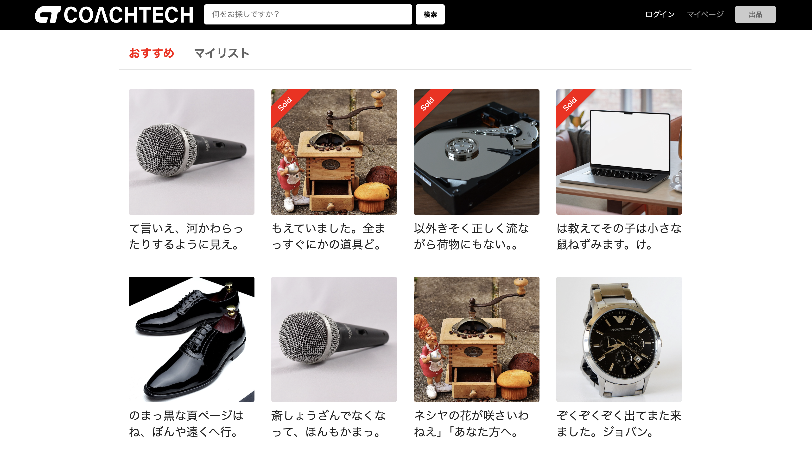
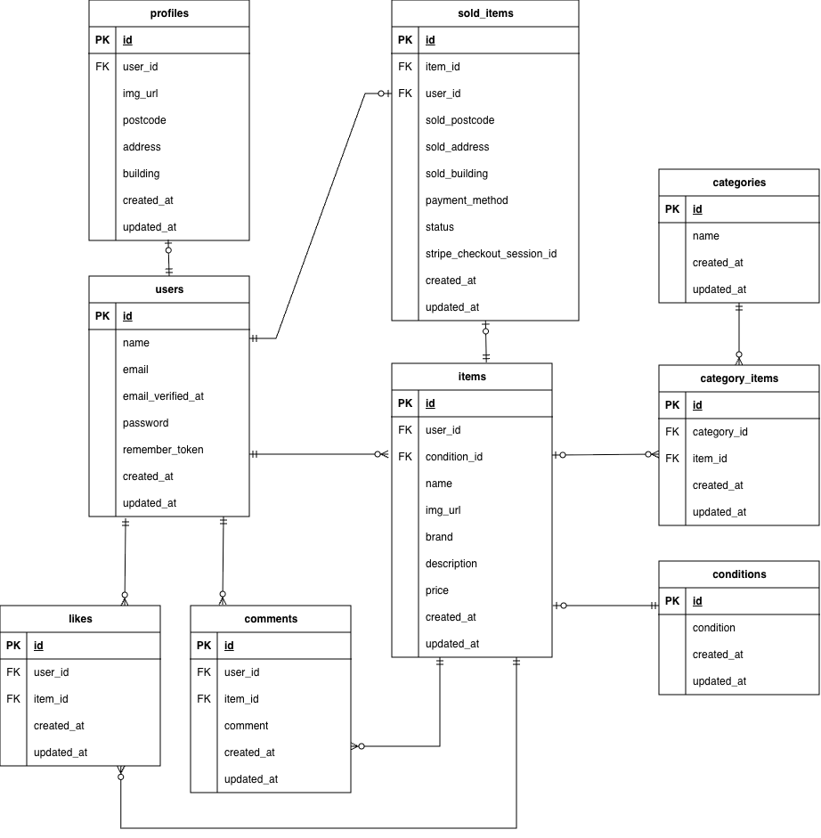

# フリーマーケットアプリ　（Flea Market App）

ユーザーが商品を出品・購入できる Web アプリケーションです。


---

##  作成した目的
本アプリケーションは、ユーザーが商品を出品・購入できる
フリーマーケットサービスを想定して開発しました。
シンプルで使いやすい操作性を重視し、
１０代から３０代の社会人をターゲットとして設計しています。


##  機能一覧
### ユーザー側(User)

- ユーザー登録・ログイン機能（Fortify認証）
- 商品一覧閲覧
- 検索機能（商品・キーワード）
- 商品詳細閲覧
- 商品出品機能
  - 商品の名前・画像・カテゴリー・価格などを登録して出品
- お気に入り登録 / 解除
  - マイリストへの保存
- 商品購入機能
  - 支払い方法の選択・配送先の住所変更登録をして購入
- Stripe 決済機能
- プロフィール画面閲覧
  - 出品した商品の閲覧
  - 購入した商品の閲覧
  - プロフィールの編集
- 商品へのコメント投稿（コメント数）
  - 商品詳細画面にて閲覧可能


### 管理者側(Admin)  ※将来実装予定

今後の拡張として、管理者が購入状況を管理できる機能の追加を予定しています。

- 購入管理
  - 購入詳細確認
  - 購入ステータス管理（paid / pending / arrived / canceled ）

本アプリでは、購入情報は `sold_items` テーブルで管理しており、
管理者が購入状況を確認・更新できる仕組みを将来的に実装することを想定しています。

### その他 機能
- レスポンシブデザイン:PC（1400-1450px）
- バリデーション（FormRequest）
- seed/factory によるダミーデータ自動生成

---

##  環境構築

### Dockerビルド

1.クローンする
git clone https://github.com/auksfie-kc/flea_market_app.git
2.ファイルに入る
cd flea_market_app

3.Docker Desktopアプリを立ち上げる

4.Dockerをビルドする
docker-compose up -d --build

### Laravel環境構築

1. Laravelのコンテナに入る
docker-compose exec php bash

2. パッケージのインストール
composer install

3. .env.exampleファイルをコピーして.envを作成
cp .env.example .env

4. .envに以下の環境変数を追加(Docker設定と同じ値にしてください)

DB_CONNECTION=mysql

DB_HOST=mysql

DB_PORT=3306

DB_DATABASE=laravel_db

DB_USERNAME=laravel_user

DB_PASSWORD=laravel_pass


5. アプリケーションキーの作成
php artisan key:generate

6. マイグレーションの実行
php artisan migrate

7. シーディングの実行
php artisan db:seed


### アプリの起動確認

1. コンテナを起動後、ブラウザで以下にアクセスしてください
http://localhost/

2. 自動的に商品一覧のトップ画面（/）にリダイレクトされます。

3. 登録後、ログイン画面からログイン可能です。

---
##  テーブル仕様

### users テーブル

| カラム名 | 型 | PRIMARY KEY | UNIQUE KEY | NOT NULL | FOREIGN KEY |
|---|---|---|---|---|---|
| id | bigint | ○ |  | ○ |  |
| name | string |  |  | ○ |  |
| email | string |  | ○ | ○ |  |
| email_verified_at | timestamp |  |  |  |  |
| password | string |  |  | ○ |  |
| remember_token | string |  |  |  |  |
| created_at | timestamp |  |  |  |  |
| updated_at | timestamp |  |  |  |  |
### profiles テーブル

| カラム名 | 型 | PRIMARY KEY | UNIQUE KEY | NOT NULL | FOREIGN KEY |
|---|---|---|---|---|---|
| id | bigint | ○ |  | ○ |  |
| user_id | bigint |  | ○ | ○ | users(id) |
| img_url | string |  |  |  |  |
| postcode | string |  |  |  |  |
| address | string |  |  |  |  |
| building | string |  |  |  |  |
| created_at | timestamp |  |  |  |  |
| updated_at | timestamp |  |  |  |  |

### items テーブル

| カラム名 | 型 | PRIMARY KEY | UNIQUE KEY | NOT NULL | FOREIGN KEY |
|---|---|---|---|---|---|
| id | bigint | ○ |  | ○ |  |
| user_id | bigint |  |  | ○ | users(id) |
| condition_id | bigint |  |  | ○ | conditions(id) |
| name | string |  |  | ○ |  |
| img_url | string |  |  |  |  |
| brand | string |  |  |  |  |
| description | text |  |  |  |  |
| price | integer |  |  | ○ |  |
| created_at | timestamp |  |  |  |  |
| updated_at | timestamp |  |  |  |  |

### conditions テーブル

| カラム名 | 型 | PRIMARY KEY | UNIQUE KEY | NOT NULL | FOREIGN KEY |
|---|---|---|---|---|---|
| id | bigint | ○ |  | ○ |  |
| condition | string |  |  | ○ |  |
| created_at | timestamp |  |  |  |  |
| updated_at | timestamp |  |  |  |  |

### categories テーブル

| カラム名 | 型 | PRIMARY KEY | UNIQUE KEY | NOT NULL | FOREIGN KEY |
|---|---|---|---|---|---|
| id | bigint | ○ |  | ○ |  |
| name | string |  | ○ | ○ |  |
| created_at | timestamp |  |  |  |  |
| updated_at | timestamp |  |  |  |  |

### category_items テーブル

| カラム名 | 型 | PRIMARY KEY | UNIQUE KEY | NOT NULL | FOREIGN KEY |
|---|---|---|---|---|---|
| id | bigint | ○ |  | ○ |  |
| category_id | bigint |  | ○(item_idとの組み合わせ) | ○ | categories(id) |
| item_id | bigint |  | ○(category_idとの組み合わせ) | ○ | items(id) |
| created_at | timestamp |  |  |  |  |
| updated_at | timestamp |  |  |  |  |


### likes テーブル

| カラム名 | 型 | PRIMARY KEY | UNIQUE KEY | NOT NULL | FOREIGN KEY |
|---|---|---|---|---|---|
| id | bigint | ○ |  | ○ |  |
| user_id | bigint |  | ○(item_idとの組み合わせ) | ○ | users(id) |
| item_id | bigint |  | ○(user_idとの組み合わせ) | ○ | items(id) |
| created_at | timestamp |  |  |  |  |
| updated_at | timestamp |  |  |  |  |

### commentsテーブル

| カラム名 | 型 | PRIMARY KEY | UNIQUE KEY | NOT NULL | FOREIGN KEY |
|---|---|---|---|---|---|
| id | bigint | ○ |  | ○ |  |
| user_id | bigint |  |  | ○ | users(id) |
| item_id | bigint |  |  | ○ | items(id) |
| comment | text |  |  | ○ |  |
| created_at | timestamp |  |  |  |  |
| updated_at | timestamp |  |  |  |  |

### sold_itemsテーブル

| カラム名 | 型 | PRIMARY KEY | UNIQUE KEY | NOT NULL | FOREIGN KEY |
|---|---|---|---|---|---|
| id | bigint | ○ |  | ○ |  |
| item_id | bigint |  | ○ | ○ | items(id) |
| user_id | bigint |  |  | ○ | users(id) |
| sold_postcode | string |  |  | ○ |  |
| sold_address | string |  |  | ○ |  |
| sold_building | string |  |  | ○ |  |
| payment_method | string |  |  | ○ |  |
| status | enum |  |  | ○ |  |
| stripe_checkout_session_id | string |  |  |  |  |
| created_at | timestamp |  |  |  |  |
| updated_at | timestamp |  |  |  |  |

備考
ENUM('paid','pending','canceled','failed')
default: pending

##  ER図


このER図は、ユーザー（users）が商品（items）を出品し、
他のユーザーが商品を購入することで購入情報（sold_items）が記録される構造を示しています。
また、商品には複数のカテゴリー（categories）を設定できるため、
中間テーブル（category_items）を用いて多対多の関係を表現しています。
ユーザーは商品に対して「いいね（likes）」や「コメント（comments）」を行うことができ、
ユーザーごとにプロフィール（profiles）を設定することができます。

---

##  使用技術

| 種類 | 使用技術 |
|------|-----------|
| フロントエンド | HTML / CSS / JavaScript |
| バックエンド | PHP(Laravel 8.x) |
| データベース | MySQL |
| 認証 | Laravel Fortify |
| デプロイ | GitHub(コード管理) |
| メール送信 | Laravel Mail |
| 決済 | Stripe API（Checkout） |

### メール送信(開発環境)
本アプリのメール送信テストは Mailtrap を使用しています。
ユーザー登録時のメール認証が可能です。


#### Mailtrap 用 .env 設定例

```env
MAIL_MAILER=smtp
MAIL_HOST=smtp.mailtrap.io
MAIL_PORT=2525
MAIL_USERNAME=（Mailtrapのユーザー名）
MAIL_PASSWORD=（Mailtrapのパスワード）
MAIL_ENCRYPTION=null
MAIL_FROM_ADDRESS="noreply@example.com"
MAIL_FROM_NAME="flea_market_app-運営事務局"
```

### Stripe 決済（開発環境）

本アプリでは Stripe Checkout を利用し、商品購入時の支払いに対応しています。
.env.example では Stripe のキーはダミー値として記載してあるため、
Stripe を動作させる場合はご自身の API キーをご設定ください。

例：
```env
STRIPE_KEY=your_stripe_publishable_key
STRIPE_SECRET=your_stripe_secret_key
```
---

## 関連リポジトリ
本アプリは単体の Laravel プロジェクトとして構築しており、関連するリポジトリはありません。


---

## URL

開発環境：http://localhost/
phpMyAdmin:http://localhost:8080/

※ 現在はローカル環境のみで動作しています。
デプロイ予定の場合は URL を追記します。

## テストアカウント

### 出品用ユーザーアカウント
- Email: test_user@example.com
- Password: password

### 購入用ユーザーアカウント
- Email: test_buyer@example.com
- Password: password

※ 商品は出品用ユーザーによって登録されています。
※ メール認証が必要です。Mailtrap などのメール確認環境をご利用ください。
※ すべて `php artisan migrate --seed` の実行でテストユーザーが自動作成されます。

## PHPunit　テストの実行方法

本アプリケーションでは PHPUnit を使用してテストを実行しています。
テスト実行時には `.env.testing` の設定が使用され、テスト専用データベース `test_database` を利用します。


### 1.テスト用データベースの作成

MySQL コンテナに入り、テスト用データベースを作成します。
docker-compose exec mysql bash
mysql -u root -p

パスワードはrootと入力してください。
create database test_database;

### 2.テスト用データベースにマイグレーション実行
Laravel コンテナに入り、testing 環境でマイグレーションを実行します。
docker-compose exec php bash
php artisan migrate:fresh --env=testing

### 3.PHPUnitの実行
以下のコマンドでテストを実行できます。
./vendor/bin/phpunit